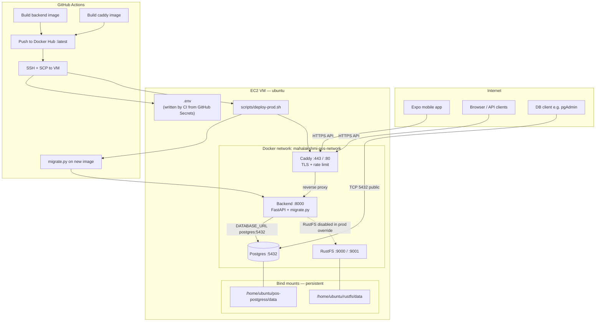

# Billing System

Mobile-first meat billing system with:

- a FastAPI backend for auth, shops, pricing, billing, receipts, audit logs, and item images
- an Expo React Native frontend for admin and shop operators
- a FastAPI-based WhatsApp sales bot that reuses backend database models and schemas
- Android Bluetooth and USB ESC/POS receipt printing
- a Caddy reverse proxy with automatic HTTPS

## Apps

- `backend/` - FastAPI API, database access, RustFS integration
- `frontend/` - Expo React Native app
- `WhatsApp Bot/` - FastAPI WhatsApp bot, using shared `backend.app` models and schemas
- `caddy/` - reverse proxy, rate limiting, DuckDNS DNS-challenge TLS
- `rustfs/` - optional object storage container helpers
- `duckdns/` - local DuckDNS update script used for cron-based IP refresh

## Product Flow

1. Admin signs in.
2. Admin creates shop users.
3. Each shop sets daily prices.
4. Counter staff add items and checkout.
5. Backend accepts a sale only when payment totals match the bill.
6. Receipt printing runs through saved Bluetooth or USB printers on Android, with fallback printing on web and iOS.
7. Receipt data and audit logs are stored immediately.

## Tech Stack

- Backend: FastAPI, SQLAlchemy async, PostgreSQL, JWT auth, `uv`
- Frontend: Expo 54, React Native, TypeScript, Zustand, React Navigation, NativeWind
- Proxy: Caddy 2 with `caddy-ratelimit` and `caddy-dns/duckdns`
- Storage: RustFS / S3-compatible object storage

## Repository Layout

```text
.
├── backend/
├── frontend/
├── WhatsApp Bot/
├── caddy/
├── rustfs/
├── duckdns/
├── compose.yaml
├── docker-compose.prod.yml
├── Makefile
├── scripts/deploy-prod.sh
└── README.md
```

## Shared Backend Domain Package

The backend package is also the shared source of truth for the WhatsApp bot's domain layer.

- SQLAlchemy models live in [`backend/app/models/`](backend/app/models/)
- Pydantic schemas live in [`backend/app/schemas/`](backend/app/schemas/)
- WhatsApp-specific shared types live in [`backend/app/models/whatsapp.py`](backend/app/models/whatsapp.py) and [`backend/app/schemas/whatsapp.py`](backend/app/schemas/whatsapp.py)
- [`WhatsApp Bot/app/models.py`](WhatsApp%20Bot/app/models.py) and [`WhatsApp Bot/app/schemas.py`](WhatsApp%20Bot/app/schemas.py) are compatibility shims that re-export from `backend.app`

When adding or changing data structures used by both services, update `backend.app` first and let the bot import from there instead of creating duplicate local definitions.

## Prerequisites

- Python `3.11+`
- `uv`
- Node.js `18+`
- npm
- Docker and Docker Compose
- PostgreSQL if running backend outside Docker
- Android emulator, device, iOS simulator, or browser for the frontend

## Local Backend

```bash
cd backend
cp .env.example .env
uv sync
uv run uvicorn main:app --reload --host 0.0.0.0 --port 8000
```

Useful backend commands:

```bash
cd backend
uv sync --group dev
uv run ruff check .
uv run ruff format .
uv run --with pytest pytest ../test/ -v
```

## Local Frontend

```bash
cd frontend
npm install
npx expo start
```

For the Android dev client and printer workflow:

```bash
cd frontend
npx expo run:android
npm run start:dev
```

If the backend runs on the same machine and the frontend is on a physical Android phone:

```bash
adb reverse tcp:8000 tcp:8000
```

## Local WhatsApp Bot

```bash
cd "WhatsApp Bot"
uv sync
uv run uvicorn main:app --reload --host 0.0.0.0 --port 8001
```

The bot keeps its routers and services in `WhatsApp Bot/app/`, but shared database models and reusable schemas come from `backend.app`.

## Docker Stack

The active Docker stack is [`compose.yaml`](compose.yaml).

Services:

- `backend`
- `caddy`

The current Caddy stack publishes:

- `80:80`
- `443:443`
- `443:443/udp`

Start it with:

```bash
docker compose -f compose.yaml up -d --build --remove-orphans
```

Or use the Makefile:

```bash
make docker-up
make docker-logs
make docker-down
```

The Makefile also supports selecting a different compose file:

```bash
make docker-up COMPOSE_FILE=docker-compose.prod.yml
```

## Production deployment guide

Production runs on an **Ubuntu EC2 VM** using [`docker-compose.prod.yml`](docker-compose.prod.yml). Images are **built in GitHub Actions**, pushed to **Docker Hub**, and the VM **pulls pre-built images** (no app source code on the server).

### Architecture



**Traffic flow**

1. Clients hit `https://<CADDY_PUBLIC_HOST>/api/v1/...`
2. **Caddy** terminates TLS and proxies to `backend:8000` on the internal network
3. **Backend** connects to **Postgres** at `postgres:5432` (Docker DNS name, not `localhost`)
4. **RustFS** runs for object storage; backend RustFS is currently disabled via [`docker-compose.prod.override.yml`](docker-compose.prod.override.yml) (images stored in Postgres until S3 API is fixed)

**What lives where**

| Location | Contents |
|----------|----------|
| GitHub Secrets | Passwords, API keys, hostnames, SSH key |
| VM `/home/ubuntu/mahalakshmi-pos/.env` | Generated each deploy from secrets (never commit) |
| VM `/home/ubuntu/pos-postgress/data` | Postgres data (survives container restarts) |
| VM `/home/ubuntu/rustfs/data` | RustFS data |
| VM `/home/ubuntu/mahalakshmi-pos/.deploy/state` | Last deployed backend/caddy image tags (rollback) |
| Docker Hub | `durozen/mahalakshmi-pos-backend:latest`, `durozen/mahalakshmi-pos-caddy:latest` |

All four services attach to **`mahalakshmi-pos-network`** (explicit bridge network in compose).

---

### How it is implemented

#### 1. CI/CD ([`.github/workflows/deploy-prod.yml`](.github/workflows/deploy-prod.yml))

| Push changes | Builds | Deploys |
|--------------|--------|---------|
| `backend/**` | Backend image → Docker Hub | Pull image → **run DB migrations** → recreate backend |
| `caddy/**` | Caddy image → Docker Hub | Caddy container |
| `docker-compose.prod.yml`, `scripts/**`, workflow | Nothing | Sync compose + `.env` only |

**Backend push flow**

1. `paths-filter` detects changes under `backend/**`
2. `build-backend` builds and pushes `mahalakshmi-pos-backend:latest` (and `:sha`)
3. `deploy` writes `.env`, SCPs compose + scripts to the VM, SSH runs `deploy-prod.sh`
4. On the VM (when `DEPLOY_BACKEND=true`): pull `:latest` → `migrate.py` on that image → recreate backend → health check (rollback on failure)

Frontend-only or caddy-only pushes do **not** run database migrations.

**Deploy job steps**

1. Build `.env.deploy` from GitHub Secrets (hostname, DB password, keys, etc.)
2. SCP to VM: compose files, `.env`, `scripts/deploy-prod.sh`, log scripts
3. SSH: `bash scripts/deploy-prod.sh`

**Important:** list env vars like `BACKEND_ALLOWED_HOSTS` are written as **single-quoted JSON** in `.env` because Docker Compose strips unquoted double quotes.

#### 2. Deploy script ([`scripts/deploy-prod.sh`](scripts/deploy-prod.sh))

```
bootstrap infra (postgres + rustfs)
  → skip if already healthy (no restart, no pull)
sync compose project (network/volumes)
  → if DEPLOY_BACKEND:
      pull :latest
      run_migrations (one-off container, same image tag)
      recreate backend
  → if DEPLOY_CADDY: pull :latest → recreate caddy
  → if ALLOWED_HOSTS in .env ≠ running container: recreate backend
  → health checks; rollback to previous tag on failure
```

Migrations run **before** the backend API container is recreated. The deploy script uses the image tag that was just pulled:

```bash
BACKEND_IMAGE_TAG="${tag}" compose run --rm --no-deps backend python migrate.py
```

`--no-deps` avoids starting the long-running backend service; Postgres must already be healthy from `bootstrap_infra`. If migration fails, the script rolls back the backend image and exits without deploying the new container.

#### 3. Caddy hostname config

At container start, [`caddy/docker-entrypoint.sh`](caddy/docker-entrypoint.sh) renders [`caddy/Caddyfile.template`](caddy/Caddyfile.template) using `CADDY_PUBLIC_HOST` (and optional `CADDY_DUCKDNS_HOST`) from `.env`.

#### 4. Backend config and container entrypoint

[`backend/app/core/config.py`](backend/app/core/config.py) reads `ALLOWED_HOSTS`, `CORS_ORIGINS`, etc. from the container environment. CI auto-builds allowed hosts from `CADDY_PUBLIC_HOST`.

[`backend/docker-entrypoint.sh`](backend/docker-entrypoint.sh) runs `migrate.py` before Gunicorn on every container start (safety net if the deploy script was skipped or the container restarts without a full deploy).

---

### Services and ports

| Service | Image | Host ports | Internal | Restarts on deploy |
|---------|-------|------------|----------|-------------------|
| `postgres` | `postgres:17-alpine` | `5432` (public) | `postgres:5432` | No |
| `rustfs` | `rustfs/rustfs:latest` | `9000`, `9001` | `rustfs:9000` | No |
| `backend` | `DOCKERHUB_USERNAME/mahalakshmi-pos-backend:latest` | — | `backend:8000` | Yes |
| `caddy` | `DOCKERHUB_USERNAME/mahalakshmi-pos-caddy:latest` | `80`, `443` | — | Yes |

Postgres is published on `0.0.0.0:5432`. You must also allow **TCP 5432** in the **EC2 security group** for external DB clients.

**External Postgres connection**

```text
Host:     <CADDY_PUBLIC_HOST or EC2 public IP>
Port:     5432
Database: meat_billing
User:     postgres
Password: <POSTGRES_PASSWORD secret>
```

---

### One-time VM setup

1. Stop old standalone containers if any:

   ```bash
   docker stop rustfs_container postgres_pos 2>/dev/null || true
   ```

2. Create deploy directory: `/home/ubuntu/mahalakshmi-pos`

3. Configure **GitHub Secrets** (see table below) — CI writes `.env` on each deploy

4. Push to `main` or run the workflow manually — first deploy bootstraps infra

5. Open EC2 security group: **80, 443** (API), **5432** (Postgres, optional/restrict by IP)

---

### GitHub Secrets

| Secret | Used for |
|--------|----------|
| `DOCKERHUB_USERNAME` | Image namespace |
| `DOCKERHUB_TOKEN` | Docker Hub login (build + VM pull) |
| `DEPLOY_HOST` | VM IP or hostname |
| `DEPLOY_USER` | SSH user (e.g. `ubuntu`) |
| `DEPLOY_SSH_KEY` | SSH private key (PEM) |
| `DEPLOY_PATH` | Deploy dir (e.g. `/home/ubuntu/mahalakshmi-pos`) |
| `CADDY_PUBLIC_HOST` | Primary API hostname — TLS + backend allowed hosts |
| `CADDY_ACME_EMAIL` | Let's Encrypt contact email |
| `POSTGRES_PASSWORD` | Database password (must match existing data dir) |
| `POSTGRES_DB`, `POSTGRES_USER` | Optional overrides (default `meat_billing` / `postgres`) |
| `RUSTFS_ACCESS_KEY`, `RUSTFS_SECRET_KEY` | Object storage |
| `RUSTFS_SERVER_DOMAINS` | RustFS console domain (e.g. `16.112.68.20:9001`) |
| `BACKEND_SECRET_KEY` | 32+ char JWT secret |
| `CADDY_DUCKDNS_HOST` | Optional second hostname |
| `DUCKDNS_API_TOKEN` | Required only when `CADDY_DUCKDNS_HOST` is set |
| `BACKEND_RUSTFS_BUCKET_NAME` | Optional |

There is **no** `BACKEND_ALLOWED_HOSTS` secret — CI generates it from `CADDY_PUBLIC_HOST`.

Example hostname secret:

```env
CADDY_PUBLIC_HOST=ec2-16-112-68-20.ap-south-2.compute.amazonaws.com
```

---

### How to update

#### Update backend code (includes DB schema)

1. Change files under `backend/` (models, `app/db/database.py`, API code, etc.)
2. Commit and push to `main`
3. GitHub Actions: build image → push `:latest` → SSH deploy → **`migrate.py` on new image** → recreate backend

Or manually: **Actions → Deploy Production → Run workflow** with `build_backend: true`.

Check deploy logs on the VM: `~/pos-logs deploy` should show `Running backend database migrations (image tag=latest)`.

#### Update Caddy / TLS / hostname

1. Change files under `caddy/` and/or update `CADDY_PUBLIC_HOST` secret
2. Push to `main` (or run workflow with `build_caddy: true`)

#### Update compose, deploy script, or secrets only

1. Change `docker-compose.prod.yml`, `scripts/**`, or GitHub Secrets
2. Push — deploy runs **without** rebuilding images (sync + env refresh)

#### Update secrets (password, hostname, etc.)

1. Change the secret in **GitHub → Settings → Secrets**
2. Re-run **Deploy Production** workflow (or push any deploy-path change)

The deploy script recreates the backend if `ALLOWED_HOSTS` in `.env` differs from the running container.

#### Update on the VM directly (emergency)

```bash
cd /home/ubuntu/mahalakshmi-pos
# edit .env if needed (use single-quoted JSON for list vars)
COMPOSE_PROFILES=infra docker compose -f docker-compose.prod.yml \
  -f docker-compose.prod.override.yml --env-file .env up -d --no-deps backend
```

Prefer GitHub Secrets + CI so changes are reproducible.

#### Update mobile app API URL

In `frontend/.env` (local, not deployed by CI):

```env
EXPO_PUBLIC_API_BASE_URL=https://<CADDY_PUBLIC_HOST>
```

---

### Database migrations

Schema updates are Alembic-based. [`backend/migrate.py`](backend/migrate.py) runs `alembic upgrade head`, then calls idempotent data/startup tasks in [`backend/app/db/database.py`](backend/app/db/database.py), which:

- seeds default catalog data
- syncs bundled item images to RustFS when RustFS is configured
- migrates legacy `items.image_data` bytes to RustFS and drops the old DB byte column

When you change models or migration logic, commit under `backend/` and push to `main` — CI/CD applies migrations on the production VM automatically.

#### When migrations run

| When | How |
|------|-----|
| **CI/CD** (push `backend/**` to `main`) | `deploy-prod.sh` → `run_migrations` with the pulled `:latest` image, then recreate backend |
| **Production container start** | [`backend/docker-entrypoint.sh`](backend/docker-entrypoint.sh) → `migrate.py` → Gunicorn |
| **FastAPI lifespan** | data/startup tasks only; schema changes must already be migrated |
| **Local dev** | run `make backend-migrate`, then `make backend-dev` |

#### Changing the schema (developer workflow)

1. Update models in `backend/app/models/`.
2. Create an Alembic revision from `backend/`: `uv run alembic revision -m "describe change"`.
3. Edit the revision in `backend/migrations/versions/`.
4. Test locally: `make backend-migrate`, then run tests.
5. Push to `main` with changes under `backend/**`.
6. Confirm the **Deploy Production** workflow succeeded and health shows `database: connected`.

#### Local commands

```bash
make backend-migrate   # one-off migration
make backend-dev       # dev server after migrations
```

#### Manual migration on the VM

```bash
cd /home/ubuntu/mahalakshmi-pos
COMPOSE_PROFILES=infra docker compose -f docker-compose.prod.yml \
  -f docker-compose.prod.override.yml --env-file .env \
  run --rm --no-deps backend python migrate.py
```

To use a specific image tag (same as deploy):

```bash
BACKEND_IMAGE_TAG=latest docker compose -f docker-compose.prod.yml \
  -f docker-compose.prod.override.yml --env-file .env \
  run --rm --no-deps backend python migrate.py
```

#### Verify DB connection

```bash
curl -sS https://<CADDY_PUBLIC_HOST>/api/v1/health
# expect: {"status":"ok","database":"connected","error":null}
```

---

### Migrating to a new VM

#### A. Move the whole stack (keep data)

1. **On old VM** — stop app containers (leave data dirs):

   ```bash
   cd /home/ubuntu/mahalakshmi-pos
   COMPOSE_PROFILES=infra docker compose -f docker-compose.prod.yml --env-file .env stop backend caddy
   ```

2. **Copy data** to new VM:

   ```bash
   rsync -avz /home/ubuntu/pos-postgress/data/  NEW_VM:/home/ubuntu/pos-postgress/data/
   rsync -avz /home/ubuntu/rustfs/data/          NEW_VM:/home/ubuntu/rustfs/data/
   ```

3. **On new VM** — install Docker, create `/home/ubuntu/mahalakshmi-pos`, update GitHub Secrets:
   - `DEPLOY_HOST` → new VM IP/hostname
   - `CADDY_PUBLIC_HOST` → new public DNS name
   - `POSTGRES_PASSWORD` → **same password** as old DB (data dir expects it)
   - `RUSTFS_SERVER_DOMAINS` → new IP:9001

4. Run **Deploy Production** workflow — infra starts, backend migrates, caddy gets TLS for new hostname

5. Update EC2 security group on new instance (80, 443, 5432 if needed)

#### B. Fresh database on same VM

```bash
cd /home/ubuntu/mahalakshmi-pos
COMPOSE_PROFILES=infra docker compose -f docker-compose.prod.yml --env-file .env stop postgres backend
mv /home/ubuntu/pos-postgress/data /home/ubuntu/pos-postgress/data.bak.$(date +%s)
mkdir -p /home/ubuntu/pos-postgress/data
COMPOSE_PROFILES=infra docker compose -f docker-compose.prod.yml --env-file .env up -d postgres
bash scripts/deploy-prod.sh   # runs migrate.py + starts backend
```

#### C. Postgres WAL corruption

If Postgres logs show `invalid checkpoint record`:

1. `docker compose ... stop postgres`
2. `bash scripts/postgres-recover.sh` (runs `pg_resetwal` after confirmation)
3. `COMPOSE_PROFILES=infra docker compose ... up -d postgres`
4. `~/pos-logs postgres`

---

### Logs and operations

After deploy, symlinks exist in the ubuntu home directory:

| Command | Action |
|---------|--------|
| `~/pos-logs` | Follow all container logs |
| `~/pos-logs backend` | Follow one service |
| `~/pos-logs export` | Write logs to `~/mahalakshmi-pos/logs/*.log` |
| `~/pos-logs tail backend` | `tail -f` exported log file |
| `~/pos-logs deploy` | Tail `logs/deploy.log` |

On the VM:

```bash
cd /home/ubuntu/mahalakshmi-pos
make docker-prod-deploy    # or: bash scripts/deploy-prod.sh
make docker-prod-logs
make docker-prod-ps
```

Check all containers share the network:

```bash
docker network inspect mahalakshmi-pos-network --format '{{range .Containers}}{{.Name}} {{end}}'
```

---

### HTTPS

Caddy config is generated at container start from [`caddy/Caddyfile.template`](caddy/Caddyfile.template) using `CADDY_PUBLIC_HOST` and optional `CADDY_DUCKDNS_HOST`.

- Primary host: automatic TLS via Let's Encrypt (HTTP-01)
- Optional DuckDNS host: DNS-01 when `CADDY_DUCKDNS_HOST` + `DUCKDNS_API_TOKEN` are set

Required secrets:

```env
CADDY_PUBLIC_HOST=ec2-xx-xx-xx-xx.region.compute.amazonaws.com
CADDY_ACME_EMAIL=your-email@example.com
```

---

### API URLs

Production (through Caddy):

- `https://<CADDY_PUBLIC_HOST>/api/v1/health`
- `https://<CADDY_PUBLIC_HOST>/docs`

Example:

- `https://ec2-16-112-68-20.ap-south-2.compute.amazonaws.com/api/v1/health`

Internal (on VM / within Docker network):

- `http://backend:8000/api/v1/health`
- `postgres:5432` (database)

Local dev:

- `http://127.0.0.1:8000/api/v1/health`

---

### Production troubleshooting

| Symptom | Likely cause | Fix |
|---------|--------------|-----|
| `Invalid host header` | EC2 hostname not in `ALLOWED_HOSTS` | Set `CADDY_PUBLIC_HOST` secret; redeploy |
| `error parsing ... allowed_hosts / cors_origins` | Docker Compose stripped JSON quotes in `.env` | Use single-quoted JSON: `'["host"]'` — CI does this automatically after latest workflow |
| Backend crash loop after deploy | Old Docker Hub image + bad env format | Fix `.env` quoting; run workflow with `build_backend: true` |
| `database: disconnected` in health | Postgres down or wrong password | Check `~/pos-logs postgres`; verify `POSTGRES_PASSWORD` matches data dir |
| Cannot connect to Postgres from PC | Security group blocks 5432 | Add inbound rule for your IP on port 5432 |
| Caddy unhealthy / TLS error | Bad Caddyfile or missing `CADDY_PUBLIC_HOST` | Check `~/pos-logs caddy`; verify secrets |

Reference env template: [`.env.prod.example`](.env.prod.example)


## DuckDNS

The repository includes [`duckdns/duck.sh`](duckdns/duck.sh), which updates the `pos-mlb` DuckDNS record.

The installed host-side script path is:

```text
/home/sachinn-p/duckdns/duck.sh
```

Typical cron entry:

```cron
*/5 * * * * /home/sachinn-p/duckdns/duck.sh >/dev/null 2>&1
```

Check the updater log with:

```bash
cat /home/sachinn-p/duckdns/duck.log
```

Important:

- if you hard-code the IP in the script, keep it aligned with your real public IP
- if your network auto-detection returns a private `10.x.x.x` address, do not use blank `ip=` mode

## DNS Notes

Public DNS and local DNS may differ.

Useful checks:

```bash
dig +short pos-mlb.duckdns.org @1.1.1.1
dig +short pos-mlb.duckdns.org @8.8.8.8
resolvectl query pos-mlb.duckdns.org
```

If public DNS is correct but this laptop still resolves the hostname to a stale private address, add a local hosts override:

```bash
echo '127.0.0.1 pos-mlb.duckdns.org' | sudo tee -a /etc/hosts
sudo resolvectl flush-caches
```

## API URLs (local / DuckDNS)

Direct backend (local dev):

- `http://127.0.0.1:8000`
- `http://127.0.0.1:8000/api/v1/health`
- `http://127.0.0.1:8000/docs`

Optional DuckDNS (if configured):

- `https://pos-mlb.duckdns.org/api/v1/health`

See **Production deployment guide → API URLs** for the primary EC2 hostname.

Internal Docker upstream:

- `http://backend:8000`

## Direct POS Printing

- Bluetooth and USB ESC/POS printing use `@haroldtran/react-native-thermal-printer`
- Expo Go cannot load the printer module
- use an Android dev build or release build for live printer testing
- web and iOS use print fallback behavior

## Testing

Backend tests:

```bash
cd backend
uv run --with pytest pytest ../test/ -v
```

Coverage:

```bash
cd backend
uv run --with pytest --with pytest-cov pytest ../test/ --cov=app --cov-report=html
```

## Helpful Commands

```bash
make docker-config
make docker-up
make docker-logs
make docker-down
make frontend-typecheck
make backend-test
```

## App Documentation

- Backend notes: [backend/README.md](backend/README.md)
- Frontend notes: [frontend/README.md](frontend/README.md)
